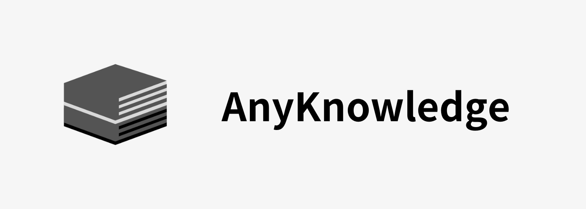

# AnyKnowledge


## <!-- [docs](https://www.google.com) -->

---

## What is AnyKnowledge

Your personal AI 「KEEP」

store text, markdown, word, video, audio

AnyKnowledge uses AI to understand your stuff.

## Deployment

-   step 0: download client

    https://github.com/waifu-lab/anyknowage/releases

-   step 1: clone this repository

```bash
git clone https://github.com/waifu-lab/anyknowage.git
cd anyknowage
```

-   step 2: Run server

```bash
docker compose pull
docker compose up
```

-   step 3: OK
